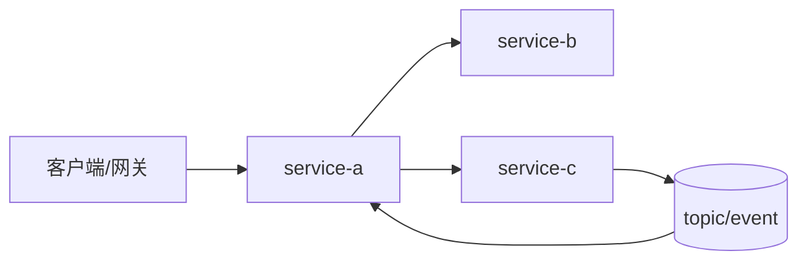
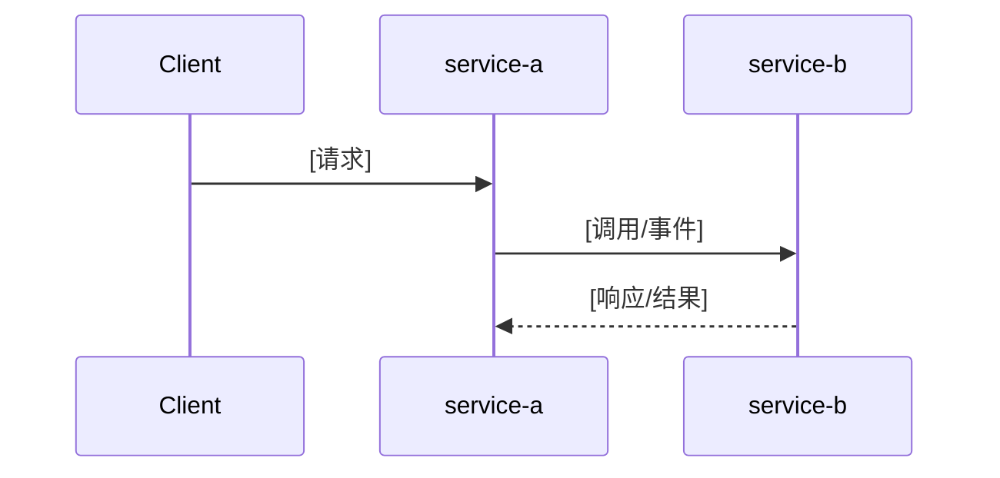

# 跨服务 AI 协作模板

> 本模板用于生成跨团队、跨微服务的 AI 协作上下文。目标不是让一个 AI 统一修改所有仓库，而是统一影响面分析、接口契约、任务拆分和可复制给各小组 AI 的 prompt。

---

## 0. AI 优先的生成约定

跨服务 AI 协作应拆成两层：

1. **项目级消费 skill**：生成 `.codebuddy/skills/cross-service-ai-collaboration/SKILL.md`，定义 AI 的任务路由、上下文加载策略、输出格式和禁止行为。
2. **事实上下文目录**：生成 `ai-system-context/`，保存服务目录、服务关系、契约索引、功能路由和服务卡片等事实资料。

所有 `ai-system-context` 文档首先服务于项目级 skill 的检索、路由和任务拆分；人类可读性是第二目标。生成时遵循：

1. **必须有项目级消费 skill**：让 AI 知道如何使用 `ai-system-context/`，而不是只生成静态模板。
2. **必须有上下文地图**：生成 `CONTEXT-MAP.md`，用结构化表格描述每个文件的职责、读取时机、依赖关系和输出用途。
3. **每个文件开头必须写清元信息**：包含 `context_type`、`purpose`、`read_when`、`depends_on`、`update_when`。
4. **按需加载，不全量塞上下文**：不同任务读取不同文件组合，降低 token 噪音。
5. **明确禁止越权**：跨团队场景下，AI 只做分析、RFC、任务单和 prompt，不直接修改其他小组服务代码。

推荐文件头格式：

```markdown
<!-- ai-context
context_type: system-overview | service-catalog | service-graph | contract-index | feature-routing | playbook | prompt-template | service-card
purpose: [本文件解决什么问题]
read_when:
  - [什么任务需要读取本文件]
depends_on:
  - [建议同时读取的文件]
update_when:
  - [什么变更发生时需要更新]
-->
```

---

## 0.1 `CONTEXT-MAP.md` — AI 上下文地图

> 读取协议、任务路由和禁止行为由 `.codebuddy/skills/cross-service-ai-collaboration/SKILL.md` 承担；`CONTEXT-MAP.md` 只保存上下文文件的结构化索引，供项目级 skill 按任务选择最小必要上下文。

````markdown
# AI 上下文地图

<!-- ai-context
context_type: context-map
purpose: 帮助 AI 根据任务类型选择最小必要上下文，避免全量读取造成噪音
read_when:
  - 任何跨服务任务开始前
  - 不确定某个文件用途时
depends_on:
  - .codebuddy/skills/cross-service-ai-collaboration/SKILL.md
update_when:
  - ai-system-context 下新增、删除、重命名文件
  - 文件职责发生变化
-->

## 核心文件职责

| 文件 | context_type | 解决的问题 | 适合读取的任务 | 依赖文件 | 典型输出 |
|---|---|---|---|---|---|
| `.codebuddy/skills/cross-service-ai-collaboration/SKILL.md` | project-skill | AI 如何使用本目录 | 所有跨服务任务 | `CONTEXT-MAP.md` | 读取计划和工作流 |
| `SYSTEM.md` | system-overview | 系统整体目标和核心业务域 | 系统理解、需求背景补全 | `SERVICE-CATALOG.md` | 系统摘要 |
| `SERVICE-CATALOG.md` | service-catalog | 服务清单、归属、职责边界 | 服务定位、小组归属判断 | `services/*.md` | 涉及服务列表 |
| `SERVICE-GRAPH.md` | service-graph | 服务、DB、MQ、外部系统之间的依赖 | 调用链分析、影响面分析 | `SERVICE-CATALOG.md`, `CONTRACTS.md` | 依赖路径、风险点 |
| `CONTRACTS.md` | contract-index | HTTP/RPC/MQ 契约和字段兼容规则 | 接口变更、字段变更、MQ 变更 | `SERVICE-GRAPH.md` | 契约影响和兼容策略 |
| `FEATURE-ROUTING.md` | feature-routing | 功能域到服务的映射 | 新需求影响面分析 | `SERVICE-CATALOG.md`, `SERVICE-GRAPH.md` | 涉及服务和推进顺序 |
| `CHANGE-PLAYBOOKS.md` | playbook | 跨服务变更 SOP | RFC、联调、发布、回滚 | `CONTRACTS.md` | 推进计划 |
| `VIBE-CODING-PROMPTS.md` | prompt-template | 给 AI 的任务 prompt | 交给各小组 AI 执行 | 任务单、服务卡片 | 可复制 prompt |
| `services/<service>.md` | service-card | 单个服务职责、边界、能力和风险 | 单服务任务拆分、服务定位 | `SERVICE-CATALOG.md` | 单服务任务边界 |
| `rfcs/<feature>.md` | feature-rfc | 具体跨服务需求方案 | 需求推进、评审、拆任务 | `FEATURE-ROUTING.md`, `CONTRACTS.md` | 小组任务输入 |
| `tasks/<feature>/<service>.md` | team-task | 单小组 / 单服务任务 | 各小组开发前 | RFC、服务卡片 | 单服务执行 prompt |

## AI 上下文加载建议

### 新需求影响面分析
最小读取集合：

1. `.codebuddy/skills/cross-service-ai-collaboration/SKILL.md`
2. `CONTEXT-MAP.md`
3. `FEATURE-ROUTING.md`
4. `SERVICE-GRAPH.md`
5. `CONTRACTS.md`

再根据候选服务读取对应 `services/<service>.md`。

### 单服务任务拆分
最小读取集合：

1. 已确认 RFC
2. `services/<service>.md`
3. `CONTRACTS.md` 中相关契约
4. `VIBE-CODING-PROMPTS.md`

### 契约变更分析
最小读取集合：

1. `CONTRACTS.md`
2. `SERVICE-GRAPH.md`
3. 相关 `services/<provider>.md`
4. 相关 `services/<consumer>.md`
5. `CHANGE-PLAYBOOKS.md`
````

---

## 1. `SYSTEM.md` — 全局系统总览

````markdown
# [系统名称] 全局 AI 上下文

## 系统一句话描述
[用业务语言描述系统整体目标]

## 核心业务域
| 业务域 | 说明 | 主要服务 | 主要小组 |
|---|---|---|---|
| [业务域] | [说明] | `[service-a]`, `[service-b]` | [小组] |

## 全局边界
**本系统负责：**
- [职责1]
- [职责2]

**本系统不负责：**
- [边界1] → 由 [外部系统/团队] 负责

## 核心链路
| 链路 | 入口 | 涉及服务 | 说明 |
|---|---|---|---|
| [链路名] | [入口] | `[service-a]` → `[service-b]` | [说明] |

## AI 使用约束
- 不直接跨团队修改代码；先生成 RFC、影响面分析和任务单。
- 不确定的服务职责、字段语义、接口兼容性统一标注 `[待确认]`。
- 涉及契约变更时，必须先生成 `FEATURE-RFC`，再拆分小组任务。
````

---

## 2. `SERVICE-CATALOG.md` — 服务目录

````markdown
# 服务目录

| 服务 | 所属小组 | 仓库 | 职责 | 不负责 | 技术栈 | 数据归属 | 对外能力 | 负责人 |
|---|---|---|---|---|---|---|---|---|
| `[service-name]` | [小组] | [repo-url/path] | [业务职责] | [边界] | [语言/框架] | [DB/表/缓存] | [HTTP/RPC/MQ] | [待确认] |

## 服务准入信息要求
每个服务至少补齐：职责边界、所属小组、仓库地址、对外接口、数据归属、常见调用方、变更审批人。
````

---

## 3. `services/<service-name>.md` — 服务卡片

````markdown
# [service-name] 服务卡片

## 所属小组
- 小组：[待确认]
- 负责人：[待确认]
- 代码仓库：[待确认]

## 服务职责
**负责：**
- [职责1]

**不负责：**
- [事项] → 由 `[other-service]` 负责

## 对外能力
| 能力 | 类型 | 契约位置 | 调用方 | 兼容性要求 |
|---|---|---|---|---|
| [接口/Topic] | HTTP/RPC/MQ | [path/url] | `[caller]` | 只能新增字段，不能破坏旧语义 |

## 依赖项
| 依赖 | 类型 | 用途 | 风险 |
|---|---|---|---|
| `[service/db/mq]` | 服务/DB/MQ | [用途] | [风险] |

## 数据归属
| 数据 | 说明 | 是否可被其他服务直接写入 |
|---|---|---|
| [DB/Table/Cache] | [说明] | 否 |

## 变更注意事项
- [接口兼容要求]
- [字段语义限制]
- [发布/灰度要求]
````

---

## 4. `SERVICE-GRAPH.md` — 服务关系图

````markdown
# 服务依赖关系图



## 调用关系明细
| 上游 | 下游 | 协议 | 用途 | 契约位置 | 归属小组 | 风险 |
|---|---|---|---|---|---|---|
| `[service-a]` | `[service-b]` | HTTP/RPC/MQ | [用途] | [path/url] | [小组] | [兼容风险] |

## 关键说明
- 箭头表示运行时依赖或异步事件依赖。
- 不确定依赖标注 `[待确认]`，不要猜测为强依赖。
````

---

## 5. `CONTRACTS.md` — 跨服务契约索引

````markdown
# 跨服务契约索引

## `[service-name]`

### `[contract-name]`

| 项 | 内容 |
|---|---|
| 类型 | HTTP / RPC / MQ / DB Read Model |
| 契约位置 | `[proto/openapi/topic/schema path]` |
| 提供方 | `[service-name]` / [小组] |
| 调用方/消费方 | `[caller-a]`, `[caller-b]` |
| 兼容性等级 | P0 强兼容 / P1 可灰度 / P2 内部 |

#### 字段说明
| 字段 | 业务含义 | 是否必填 | 是否可删除 | 变更规则 |
|---|---|---|---|---|
| `field_name` | [含义] | 是/否 | 否 | 只能新增，语义不可变 |

#### 变更规则
- 新增字段：默认允许，但必须补文档和测试。
- 删除字段：默认禁止，必须走 RFC。
- 修改字段语义：默认禁止，必须走 RFC 和灰度。
- 新增枚举值：必须通知所有消费方确认兜底逻辑。
````

---

## 6. `FEATURE-ROUTING.md` — 功能路由表

````markdown
# 功能路由表

## [功能域/业务链路]

### 通常涉及服务
| 服务 | 所属小组 | 涉及原因 | 常见改动 | 是否主责 |
|---|---|---|---|---|
| `[service-a]` | [小组] | [原因] | [接口/逻辑/数据/事件] | 是/否 |

### 推荐推进顺序
1. 先确认数据归属服务是否需要新增字段或接口。
2. 再确认主流程服务是否需要调整业务逻辑。
3. 再确认下游服务是否只消费结果，是否需要感知新语义。
4. 最后确认联调、灰度、回滚和监控。

### 常见契约风险
- [风险1]
- [风险2]

### 适用 RFC 模板
使用 `FEATURE-RFC.template.md` 生成具体需求 RFC。
````

---

## 7. `FEATURE-RFC.template.md` — 跨服务功能 RFC

````markdown
# 跨服务功能 RFC：[需求名称]

## 需求背景
[为什么要做]

## 业务目标
[做成后业务上得到什么]

## 非目标
[明确不做什么，防止范围膨胀]

## 涉及服务和小组
| 服务 | 小组 | 是否必须改 | 改动类型 | 原因 | 待确认项 |
|---|---|---|---|---|---|
| `[service-a]` | [小组] | 是/否/待确认 | 接口/逻辑/数据/MQ/配置 | [原因] | [待确认] |

## 跨服务数据流


## 契约变更
### `[service-name]` / `[contract-name]`
- 变更类型：新增字段 / 新增接口 / 新增 Topic / 修改语义 / 废弃字段
- 兼容性：兼容 / 需要灰度 / 不兼容
- 变更内容：

| 字段/接口 | 当前 | 目标 | 兼容策略 |
|---|---|---|---|
| `[field]` | [当前] | [目标] | [策略] |

## 小组任务拆分
### [小组名] / `[service-name]`
- 输入：[依赖谁提供什么]
- 输出：[交付什么契约/能力]
- 开发任务：
  - [任务1]
- 测试任务：
  - [测试1]
- 文档任务：
  - 更新服务卡片/契约索引/接口文档

## 联调计划
| 阶段 | 参与服务 | 前置条件 | 验收标准 |
|---|---|---|---|
| [阶段] | `[service-a]`, `[service-b]` | [条件] | [标准] |

## 发布和回滚
- 发布顺序：[先下游/先上游/先兼容字段]
- 灰度策略：[策略]
- 回滚策略：[策略]

## 风险和待确认项
| 风险/问题 | 影响 | 负责人 | 状态 |
|---|---|---|---|
| [问题] | [影响] | [小组/人] | 待确认 |
````

---

## 8. `TEAM-TASK.template.md` — 小组任务单

````markdown
# 小组任务单：[需求名称] / [小组名] / `[service-name]`

## 上下文
- 来源 RFC：`rfcs/[feature].md`
- 本服务职责：[从服务卡片摘录]
- 本次任务边界：[只说明本服务要做什么]

## 输入依赖
| 来源服务/小组 | 输入 | 契约位置 | 状态 |
|---|---|---|---|
| `[service-a]` | [字段/接口/事件] | [path] | 待确认/已确认 |

## 本服务交付
| 交付项 | 类型 | 说明 | 验收标准 |
|---|---|---|---|
| [交付项] | 代码/接口/测试/文档 | [说明] | [标准] |

## 建议实现顺序
1. 阅读本仓库 `AGENTS.md` 和相关接口文档。
2. 定位接口/业务逻辑/数据模型。
3. 输出本服务修改计划。
4. 实现代码和测试。
5. 更新本服务文档。
6. 回填 RFC 中本服务状态。

## 给本小组 AI 的 Prompt
```text
你现在只负责 `[service-name]`，不要修改其他服务。
请先阅读本仓库 `AGENTS.md`、本任务单和相关契约文档。
本次任务是：[任务摘要]。
请先输出：
1. 当前仓库中相关模块和文件位置；
2. 是否需要接口契约变更；
3. 兼容性风险；
4. 修改计划和测试计划。
先不要直接改代码，除非任务单明确要求进入实现阶段。
```
````

---

## 9. `CHANGE-PLAYBOOKS.md` — 跨服务变更 SOP

````markdown
# 跨服务变更 SOP

## 新增跨服务功能
1. 使用 `SERVICE-CATALOG.md` 和 `FEATURE-ROUTING.md` 判断涉及服务。
2. 使用 `CONTRACTS.md` 确认接口、RPC、MQ、数据契约。
3. 生成 `rfcs/<feature>.md`，先做影响面分析，不直接写代码。
4. 按服务归属拆分 `tasks/<feature>/<team>.md`。
5. 各小组在各自仓库使用任务单和本仓库 `AGENTS.md` 开发。
6. 联调前确认契约版本、测试数据、灰度开关、回滚策略。
7. 上线后回填 `CONTRACTS.md`、`FEATURE-ROUTING.md` 和服务卡片。

## 契约变更默认原则
- 优先新增，不修改旧语义。
- 优先兼容发布，再切流量，最后废弃旧字段。
- MQ 消息必须考虑老消费者。
- 数据归属服务负责解释字段语义，调用方不得自行推断。
````

---

## 10. `VIBE-CODING-PROMPTS.md` — Prompt 模板

````markdown
# Vibe Coding Prompt 模板

## 全局分析 Prompt
```text
你现在是跨微服务需求分析助手，不要直接写代码。
请先按 `.codebuddy/skills/cross-service-ai-collaboration/SKILL.md` 和 `CONTEXT-MAP.md` 的加载协议选择上下文。
本次建议阅读：
- .codebuddy/skills/cross-service-ai-collaboration/SKILL.md
- CONTEXT-MAP.md
- SYSTEM.md
- SERVICE-CATALOG.md
- SERVICE-GRAPH.md
- CONTRACTS.md
- FEATURE-ROUTING.md

需求：[填写需求]

请输出：
1. 涉及服务和小组；
2. 每个服务涉及原因；
3. 数据流和调用链；
4. 契约变更点；
5. 兼容性风险；
6. 推荐推进顺序；
7. 各小组任务单草稿；
8. 待确认问题。
```

## 单服务执行 Prompt
```text
你现在只负责 `[service-name]`。
请阅读：
- 本仓库 AGENTS.md
- 服务卡片 services/[service-name].md
- 小组任务单 tasks/[feature]/[team].md

请先输出修改计划、影响面、测试计划和风险点。不要跨仓库修改其他服务。
```
````
