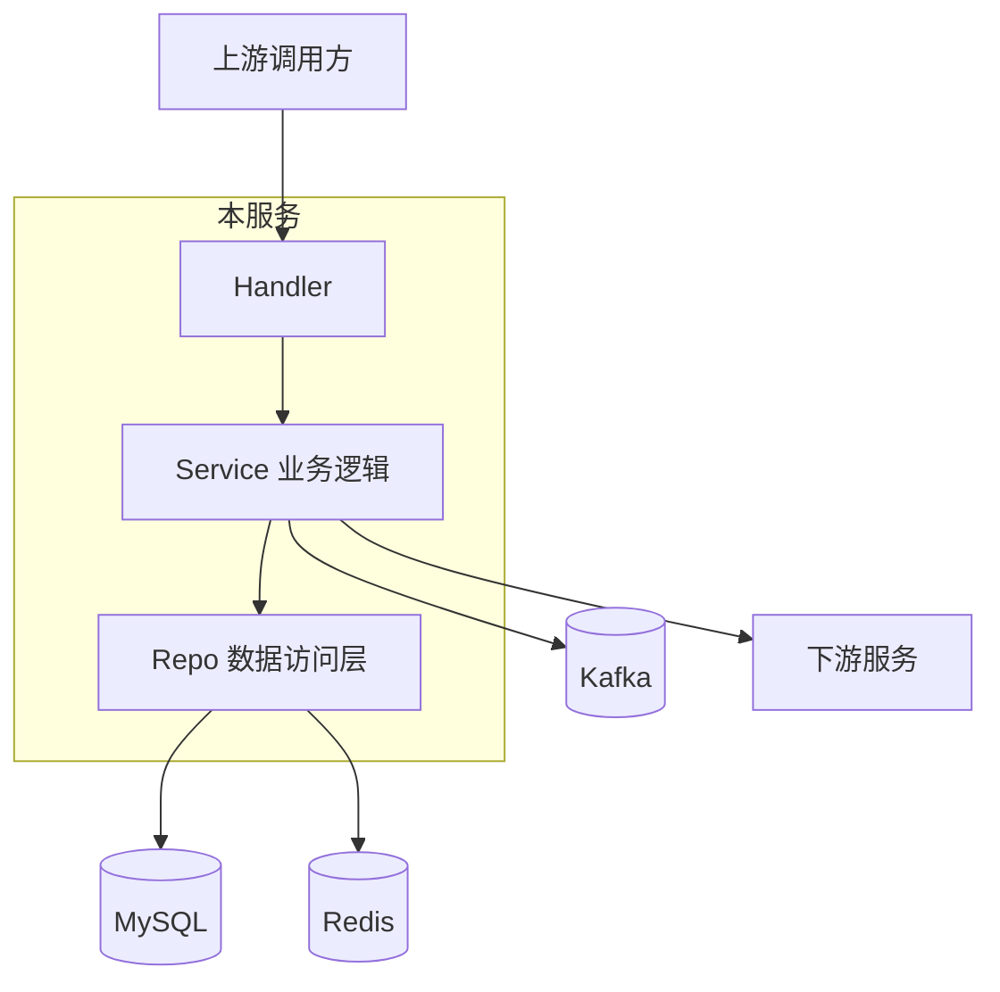

# 架构设计文档

> 本文件是**架构入口**，服务对象：架构师、Tech Lead、跨团队对接人、新加入的核心开发者。
> 业务背景见 [`README.md`](./README.md)。AI 协作约束见 [`AGENTS.md`](./AGENTS.md)。架构深化设计见 [`docs/architecture-design.md`](./docs/architecture-design.md)。

---

## 一、整体架构图

> 用 ASCII 或 Mermaid 画出服务上下游位置 + 内部核心模块。

```
                  ┌──────────────────────────────────────┐
                  │           [上游调用方]                │
                  │  [前端 / 网关 / 其他服务]              │
                  └──────────────┬───────────────────────┘
                                 │
                  ┌──────────────▼───────────────────────┐
                  │           [本服务名称]                │
                  │  ┌───────────┐  ┌──────────────────┐  │
                  │  │ Handler   │→ │ Service          │  │
                  │  │ (HTTP/RPC)│  │ (业务逻辑)        │  │
                  │  └───────────┘  └────────┬─────────┘  │
                  │                          │            │
                  │                  ┌───────▼──────┐     │
                  │                  │  Repo (DAL)  │     │
                  │                  └───────┬──────┘     │
                  └──────────────────────────┼────────────┘
                       ┌───────────┬─────────┼─────────┬──────────┐
                       ▼           ▼         ▼         ▼          ▼
                   [MySQL]     [Redis]   [Kafka]  [下游服务]   [外部 API]
```

> Mermaid 版本（如团队 Wiki 支持）：



---

## 二、模块划分与边界

| 模块 | 路径 | 负责什么 | 不负责什么 |
|---|---|---|---|
| Handler | `internal/handler/` | 参数解析、响应组装、协议适配 | 业务逻辑、数据访问 |
| Service | `internal/service/` | 业务规则、事务编排、跨模块协作 | 协议细节、SQL 拼接 |
| Repo | `internal/repo/` | 数据访问、SQL/缓存操作 | 业务规则 |
| Model | `internal/model/` | 业务实体、值对象 | 行为逻辑 |
| `[待补充模块]` | `[路径]` | `[职责]` | `[不负责事项]` |

**单一职责原则**：模块边界一旦确立，不允许跨模块直调（如 Handler 绕过 Service 直接调 Repo）。

---

## 三、核心数据流

> 选 2-3 个最有代表性的业务流程，画出端到端数据流。

### 流程 1：[业务流程名称，如「创建订单」]

```
1. Client       → POST /api/orders
2. Handler      → 解析请求、参数校验
3. Service      → 业务规则校验（库存、风控、限购）
4. Service      → 事务开启
5. Repo         → INSERT orders
6. Repo         → UPDATE inventory（扣减库存）
7. Service      → 发送 MQ 消息（order.created）
8. Service      → 事务提交
9. Handler      → 返回订单 ID
```

**关键设计点：**
- [设计点 1：例如「库存扣减与订单创建在同一事务内」]
- [设计点 2：例如「MQ 消息在事务提交后发送，避免回滚后误发」]

### 流程 2：[`[待补充]`]

### 流程 3：[`[待补充]`]

---

## 四、技术选型理由

> 不只是"用了什么"，而是"为什么选这个"。

| 技术 | 选型 | 理由 | 备选方案 |
|---|---|---|---|
| 编程语言 | [Go 1.21] | [高并发、生态完善、团队熟悉] | [Java / Rust] |
| Web 框架 | [Gin] | [轻量、社区活跃、性能高] | [Echo / Fiber] |
| ORM | [GORM / sqlx / 原生 SQL] | [选 X 的核心理由] | [其他选项及为什么没选] |
| 数据库 | [MySQL 8.0] | [事务支持、生态成熟] | [PostgreSQL] |
| 缓存 | [Redis 7.0] | [集群方案成熟、团队运维经验] | [Memcached] |
| 消息队列 | [Kafka / RocketMQ] | [选型理由] | [备选] |
| 服务发现 | [Polaris / Consul / K8s Service] | [选型理由] | [备选] |
| 配置中心 | [七彩石 / Apollo / Nacos] | [选型理由] | [备选] |
| 日志 | [zap / logrus] | [选型理由] | [备选] |
| 监控 | [Prometheus + Grafana] | [选型理由] | [备选] |

---

## 五、核心设计决策（ADR 摘要）

> 详细 ADR 全文见 [`docs/decision-log.md`](./docs/decision-log.md)，本节只放摘要。

### ADR-001: [决策标题]
- **日期**：YYYY-MM-DD
- **决策**：[一句话决策]
- **理由**：[一句话理由]
- **影响**：[带来的约束 / 技术债]

### ADR-002: [决策标题]
- **日期**：YYYY-MM-DD
- **决策**：[`[待补充]`]
- **理由**：[`[待补充]`]
- **影响**：[`[待补充]`]

---

## 六、已知技术债

> 诚实记录当前架构的不足，避免 AI 或新人"好心重构"踩坑。

| # | 技术债项 | 影响范围 | 计划处理时间 | 临时规避方案 |
|---|---|---|---|---|
| 1 | [例：订单状态机硬编码在多处] | [影响：新增状态需改 3 个文件] | [Q3] | [新增前先看 `internal/service/order_state.go` 注释] |
| 2 | [`[待补充]`] | | | |
| 3 | [`[待补充]`] | | | |

> AI 修改时若发现新的技术债，应记录到本表，而不是擅自重构。

---

## 七、容量与性能

| 指标 | 当前值 | 目标值 | 监控位置 |
|---|---|---|---|
| QPS | [X] | [X] | [Grafana 面板] |
| P99 延迟 | [X ms] | [X ms] | [监控面板] |
| 错误率 | [X%] | [< 0.1%] | [告警平台] |
| DB 连接池 | [X] | [X] | [配置] |
| Goroutine / 线程数 | [X] | [X] | [pprof] |

---

## 八、扩展点与未来演进

- [扩展点 1：例如「支付通道抽象为 Strategy 接口，新增通道无需改主流程」]
- [扩展点 2]
- [未来演进方向 1：例如「Q4 拆出独立的风控服务」]

---

## 九、与其他文档的关系

| 文档 | 用途 |
|---|---|
| [`README.md`](./README.md) | 业务背景、快速启动、上下游 |
| [`AGENTS.md`](./AGENTS.md) | AI 行为约束、修改路径 |
| [`docs/architecture-design.md`](./docs/architecture-design.md) | 架构详细设计、子系统深化 |
| [`docs/decision-log.md`](./docs/decision-log.md) | ADR 长版 |
| [`docs/domain-model.md`](./docs/domain-model.md) | 领域模型详情 |
| [`harness/`](./harness/) | 规约库（编码 / API / 测试 / DB / 部署等） |
