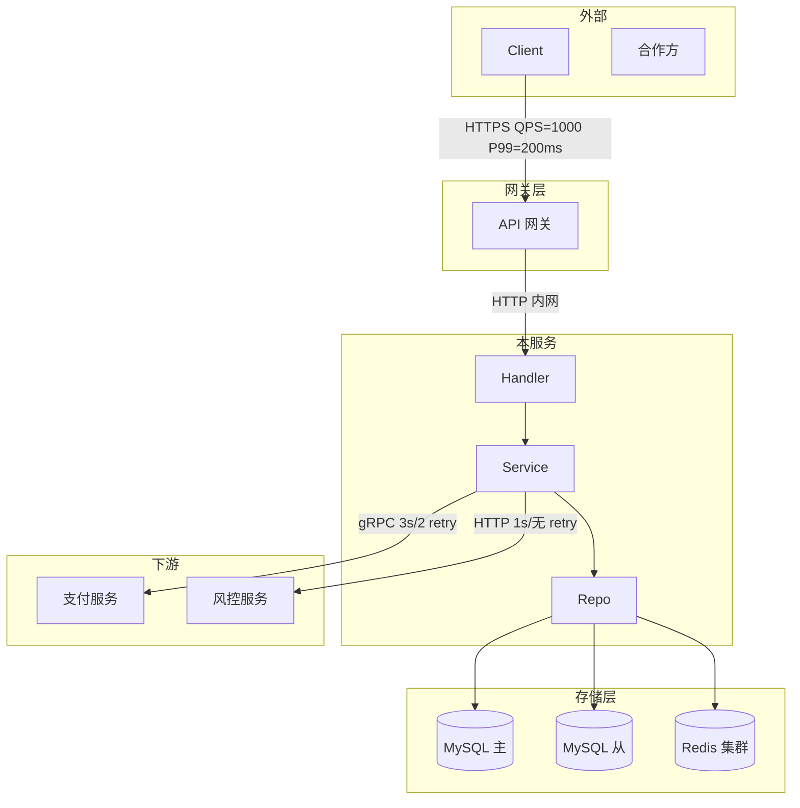
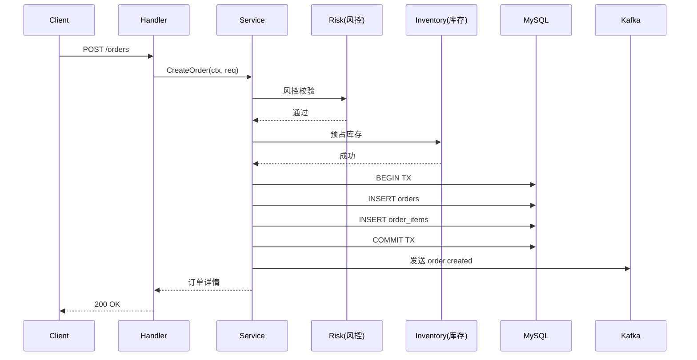

# 架构设计深化文档

> **文档定位**：`docs/architecture-design.md` 是顶层 [`ARCHITECTURE.md`](../ARCHITECTURE.md) 的**深化版**。
> - 顶层 `ARCHITECTURE.md`：摘要（架构图 + 关键 ADR + 技术债清单），≤500 行
> - 本文件：详细设计、子系统深化、性能容量规划、跨子系统数据流详解，可以很长
>
> 阅读顺序：先读 `ARCHITECTURE.md`，再按需读本文件对应章节。

---

## 一、系统全景

### 1.1 上下文图（详细版）

> 比 `ARCHITECTURE.md` 更详细的上下文图，标注每条边的协议、QPS、超时。



### 1.2 子系统划分

| 子系统 | 路径 | 职责 | 详细设计章节 |
|---|---|---|---|
| 订单子系统 | `internal/order/` | 订单生命周期管理 | §二 |
| 支付子系统 | `internal/payment/` | 支付编排、对账 | §三 |
| 履约子系统 | `internal/fulfillment/` | 仓配、物流 | §四 |
| `[待补充]` | | | |

---

## 二、子系统：[订单子系统] 深化设计

### 2.1 职责边界

- ✅ 负责：[职责清单]
- ❌ 不负责：[不负责清单] → 由 [其他子系统/服务] 负责

### 2.2 内部模块

```
internal/order/
├── handler/         # HTTP/RPC 入口
├── service/         # 业务逻辑
│   ├── creator.go   # 订单创建
│   ├── canceller.go # 订单取消
│   └── querier.go   # 订单查询
├── repo/            # 数据访问
└── model/           # 实体
```

### 2.3 核心数据流（详细）

#### 流程：创建订单（完整版）



**关键设计点：**

1. **预占库存先于事务**：避免长事务持有库存锁
2. **MQ 发送在事务提交后**：避免事务回滚导致脏消息
3. **风控同步调用**：3 秒超时后降级（具体策略见 ADR-XXX）

### 2.4 性能与容量

| 指标 | 当前值 | 目标值 | 监控位置 |
|---|---|---|---|
| QPS | `[X]` | `[X]` | `[Grafana 面板]` |
| P50 延迟 | `[X ms]` | `[X ms]` | |
| P99 延迟 | `[X ms]` | `[X ms]` | |
| 单机内存 | `[X MB]` | `[X MB]` | |
| DB QPS | `[X]` | `[X]` | |
| 缓存命中率 | `[X%]` | `[> 95%]` | |

### 2.5 关键设计决策（详细 ADR）

> 完整 ADR 见 [`docs/decision-log.md`](./decision-log.md)，本节只列与本子系统相关的。

- **ADR-001**：订单状态机集中管理（理由：避免散落各处难维护）
- **ADR-002**：订单号生成用雪花算法（理由：分布式 + 趋势递增）
- **ADR-003**：`[待补充]`

---

## 三、子系统：[支付子系统] 深化设计

`[待补充]`

---

## 四、子系统：[履约子系统] 深化设计

`[待补充]`

---

## 五、跨子系统协作

### 5.1 子系统间依赖

```
订单 → 支付（同步 gRPC）
订单 → 履约（异步 MQ，order.paid 事件触发）
支付 → 订单（回调 webhook）
履约 → 订单（异步 MQ，order.shipped 事件）
```

### 5.2 跨子系统数据一致性

| 场景 | 一致性级别 | 实现方式 |
|---|---|---|
| 订单创建 + 库存扣减 | 强一致 | DB 事务 |
| 订单状态 + 履约状态 | 最终一致 | MQ 事件驱动 + 对账 |
| 支付结果 + 订单状态 | 最终一致 + 幂等 | 回调 + 主动查询补偿 |

---

## 六、横切关注点

### 6.1 鉴权

- 入口：API 网关统一鉴权
- 内部：Service 间调用基于服务身份（不依赖用户态）
- 敏感操作：二次鉴权（详见 [`harness/code-review.md`](../harness/code-review.md)）

### 6.2 限流

| 维度 | 实现 | 阈值 |
|---|---|---|
| 全局 QPS | 网关层 | `[X]` |
| 单 IP QPS | 网关层 | `[X]` |
| 单用户 QPS | 业务层（Redis） | `[X]` |

### 6.3 容灾

- 多可用区部署
- 数据库主从切换
- 缓存击穿/雪崩防护
- 详见 [`docs/runbook.md`](./runbook.md)

### 6.4 可观测性

- Tracing：`[OpenTelemetry / Jaeger / SkyWalking]`
- Metrics：Prometheus + Grafana
- Logging：结构化日志 + ELK
- 详见 [`harness/deployment.md`](../harness/deployment.md)

---

## 七、扩展点

### 7.1 已有扩展点

| 扩展点 | 接口定义 | 当前实现 |
|---|---|---|
| 支付通道 | `PaymentChannel` interface | 微信、支付宝、银行卡 |
| 物流方 | `LogisticsProvider` interface | 顺丰、邮政 |
| `[待补充]` | | |

### 7.2 未来演进

- `[未来演进方向 1，预期 Q?]`
- `[未来演进方向 2]`

---

## 八、已知技术债（详细版）

> 顶层 `ARCHITECTURE.md` 只列摘要，本节列详情与处理计划。

### 技术债 #001：`[待补充]`

- **现状**：`[详细描述]`
- **影响**：`[业务/性能/可维护性影响]`
- **形成原因**：`[历史原因]`
- **处理方案**：`[建议方案]`
- **预计投入**：`[人天]`
- **优先级**：P0 / P1 / P2
- **临时规避**：`[当前规避方式]`

---

## 九、参考资料

- 顶层架构 → [`ARCHITECTURE.md`](../ARCHITECTURE.md)
- 领域模型 → [`docs/domain-model.md`](./domain-model.md)
- 接口契约 → [`docs/api.md`](./api.md)
- ADR 长版 → [`docs/decision-log.md`](./decision-log.md)
- 运维手册 → [`docs/runbook.md`](./runbook.md)
