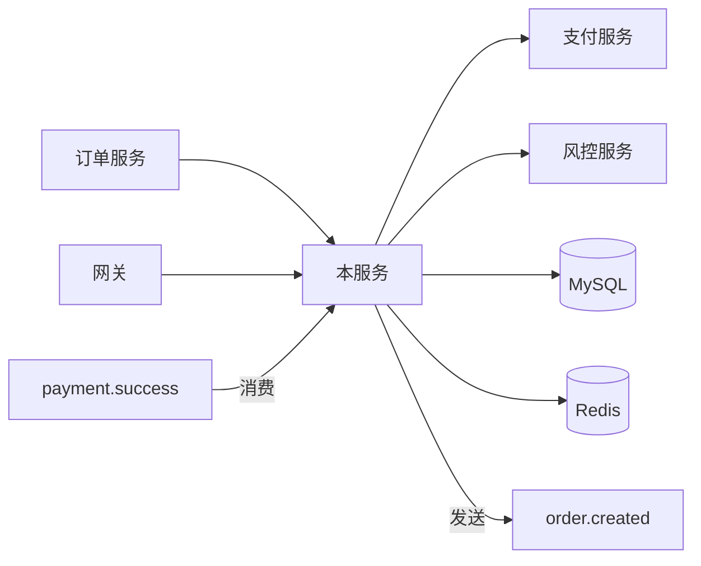

# 上下游依赖图谱

> **规约定位**：明确本服务的上下游边界、调用方式与契约位置。任何上下游变更必须先更新此文档，再修改代码。
>
> **门禁联动**：依赖变更未更新本文档 → Code Review 阻断；新增依赖未在 commit message 说明 → PreCommit Hook 警告。

---

## 一、上游：我调用谁

> 列出本服务**主动发起**调用的所有外部依赖（服务、中间件、第三方 API）。

### 1.1 服务依赖

| 依赖服务 | 归属团队 | 协议 | 用途 | 契约位置 | 超时/重试 | 降级策略 |
|---|---|---|---|---|---|---|
| `[支付服务]` | `[支付组]` | HTTP / gRPC | `[扣款、退款]` | `[proto 文件路径或 swagger 链接]` | `3s / 2 次` | `[降级返回什么]` |
| `[待补充]` | | | | | | |

### 1.2 中间件依赖

| 中间件 | 实例/集群 | 用途 | 关键配置 | 故障影响 |
|---|---|---|---|---|
| MySQL | `[实例名]` | `[主存储]` | `[连接池大小]` | `[强依赖 / 弱依赖]` |
| Redis | `[实例名]` | `[缓存 / 分布式锁]` | `[Key 命名规范见 harness/database.md]` | `[强 / 弱]` |
| Kafka | `[集群名]` | `[发送 order.created 等事件]` | `[Topic 列表]` | `[强 / 弱]` |
| `[其他]` | | | | |

### 1.3 第三方 API 依赖

| 第三方 | 用途 | 鉴权方式 | 限流配额 | SLA |
|---|---|---|---|---|
| `[微信支付]` | `[支付]` | `[商户号 + API Key]` | `[QPS 上限]` | `[供应商承诺]` |
| `[待补充]` | | | | |

---

## 二、下游：谁调用我

> 列出**主动调用本服务**的所有外部方。

| 调用方 | 归属团队 | 调用接口 | 业务场景 | QPS 估算 | 兼容性等级 |
|---|---|---|---|---|---|
| `[订单服务]` | `[订单组]` | `POST /api/v1/pay` | `[订单支付]` | `[峰值 QPS]` | P0 不可破坏 |
| `[待补充]` | | | | | |

**兼容性等级说明**：
- **P0**：核心接口，任何不兼容变更必须走 RFC + 全链路灰度
- **P1**：常规接口，不兼容变更需提前 2 周通知
- **P2**：边缘接口，可在小版本内调整

---

## 三、消息队列依赖

### 3.1 我生产的消息（Producer）

| Topic | 业务事件 | 消费方 | Schema 位置 | 兼容策略 |
|---|---|---|---|---|
| `order.created` | `[订单创建]` | `[履约服务、风控服务]` | `[schema 路径]` | 只新增字段 |
| `[待补充]` | | | | |

### 3.2 我消费的消息（Consumer）

| Topic | 生产方 | 消费场景 | 幂等策略 | 失败处理 |
|---|---|---|---|---|
| `payment.success` | `[支付服务]` | `[更新订单状态]` | `[基于 event_id 去重]` | `[死信队列 + 告警]` |
| `[待补充]` | | | | |

---

## 四、依赖关系图

---

## 五、依赖变更流程（强约束）

| 变更类型 | 流程 |
|---|---|
| 新增上游依赖（调用新服务/中间件） | 1. 评估必要性 → 2. 与归属团队对齐 SLA → 3. 更新本文档 → 4. 实现 |
| 升级中间件版本 | 1. 测试环境验证 → 2. 灰度发布 → 3. 更新本文档 |
| 接口签名变更（我作为提供方） | 1. 通知所有下游 → 2. 走 P0/P1 流程 → 3. 更新 [`docs/api.md`](../docs/api.md) |
| 删除上游依赖 | 1. 确认无残留代码 → 2. 移除配置 → 3. 更新本文档 |

---

## 六、AI 行为约束

- AI 不得在未更新本文档的情况下**新增上游调用**
- AI 不得**编造**未在本文档列出的依赖关系
- AI 修改契约相关代码前必须先读 [`harness/api-standards.md`](./api-standards.md)
- 不确定的依赖归属一律标注 `[待确认]`，禁止猜测

---

## 七、待确认清单

| # | 待确认项 | 负责人 |
|---|---|---|
| 1 | `[待补充：哪些依赖的归属团队尚不明确]` | `[待确认]` |
